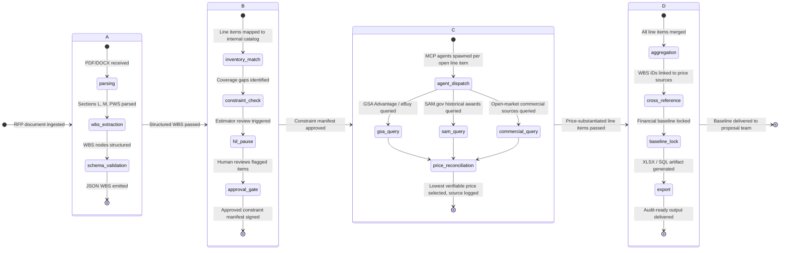

<!-- docs/architecture.md -->

# Architecture

**Project Sentinel is a four-stage, deterministic pipeline.** Each stage has a defined input contract, a defined output schema, and explicit failure modes. There are no probabilistic black boxes between ingestion and output.

---

## Pipeline Overview


---

## Stage A — Task Decomposer

**Input:** Raw RFP file (PDF, DOCX, or SAM.gov API payload)
**Output:** Leveled WBS in validated JSON schema

The Task Decomposer parses the Statement of Work, Section L (Instructions), and Section M (Evaluation Criteria) using a structured extraction model trained on FAR Part 15 document conventions. It does not summarize. It identifies discrete deliverables, labor categories, ODC line items, and period-of-performance constraints and maps them to a formal WBS hierarchy (Level 1–4).

**Failure mode:** If the PWS is ambiguous or cross-references an attachment not included in the upload, the stage flags the gap as an unresolved node and routes it to the HIL checkpoint rather than inferring a value.
```json
{
  "wbs_id": "1.2.3",
  "title": "On-Site Field Technician Support",
  "labor_category": "Field Technician II",
  "period_of_performance": "12 months",
  "estimated_hours": null,
  "constraint_source": "PWS Section 4.2",
  "status": "open"
}
```

---

## Stage B — HIL Checkpoint

**Input:** Structured WBS JSON
**Output:** Approved constraint manifest (signed with estimator ID and timestamp)

This is the mandatory human gate. Sentinel maps each WBS node against the client's internal labor category catalog, subcontractor roster, and equipment inventory. Line items with an existing internal source are marked `covered`. Line items with no match are marked `open` and queued for external research.

The estimator reviews the `open` queue, confirms or overrides categorizations, and digitally approves the manifest. **No external research agent is spun up until this approval is recorded.** This is not a UX nicety. It is an architectural constraint that prevents unauthorized external data exposure and ensures the estimator retains direct responsibility for the scope definition.

!!! warning "HIL is Not Optional"
    Stage C will not execute without a cryptographically signed approval token from Stage B. This is enforced at the pipeline level, not the application level.

---

## Stage C — Deep Research Fan-Out

**Input:** Approved constraint manifest
**Output:** Price-substantiated line item records with source citations

For each `open` line item, Sentinel dispatches a dedicated MCP agent. Agents run in parallel, bounded by configurable concurrency limits. Each agent is scoped to a single line item and a defined source priority order:

1. GSA Advantage / GSA eBuy (contract vehicles)
2. SAM.gov historical contract awards (FPDS-NG data)
3. FOIA-released pricing disclosures
4. Verified open-market commercial sources

The agent selects the **lowest verifiable price** that satisfies the specification constraints. It does not interpolate between sources. If no verifiable price is found within the source hierarchy, the line item is returned as `unresolved` with the research log attached—never with a fabricated value.

**Source integrity:** Every price record includes the source URL, retrieval timestamp, contract vehicle number (if applicable), and the specific specification match criteria used.

---

## Stage D — Compiler

**Input:** Price-substantiated line item records + approved WBS
**Output:** Locked financial baseline in XLSX and/or SQL

The Compiler aggregates all priced line items, links each to its WBS node ID, applies the fee/wrap rate structure defined in the client's configuration, and generates the baseline artifact. The output schema is fixed and validated against the client's proposal template on every run.

**Output targets:**

- **XLSX:** Pre-formatted to client proposal template (cost volume structure)
- **SQL:** Direct push to client's ERP or opportunity management database
- **JSON:** Machine-readable baseline for downstream proposal automation tools

No pricing data leaves the pipeline without the full source citation chain attached. The artifact is signed with a pipeline run ID that can be used to retrieve the full audit log at any point.

---

## Configuration Schema
```yaml
sentinel:
  pipeline:
    concurrency_limit: 12         # Max parallel MCP agents in Stage C
    hil_timeout_hours: 48         # Stage B approval window before RFP is flagged stale
    unresolved_threshold: 0.05    # Max % of open line items allowed before Stage D is blocked

  sources:
    priority_order:
      - gsa_advantage
      - fpds_ng
      - foia_disclosures
      - commercial_open_market
    commercial_domain_allowlist:
      - grainger.com
      - mscdirect.com
      - gsa.gov
      - unison.com

  output:
    format: [xlsx, sql, json]
    fee_structure: client_config   # Loaded from client profile on instantiation
    baseline_lock: true            # Prevents post-compilation edits without re-run
```
