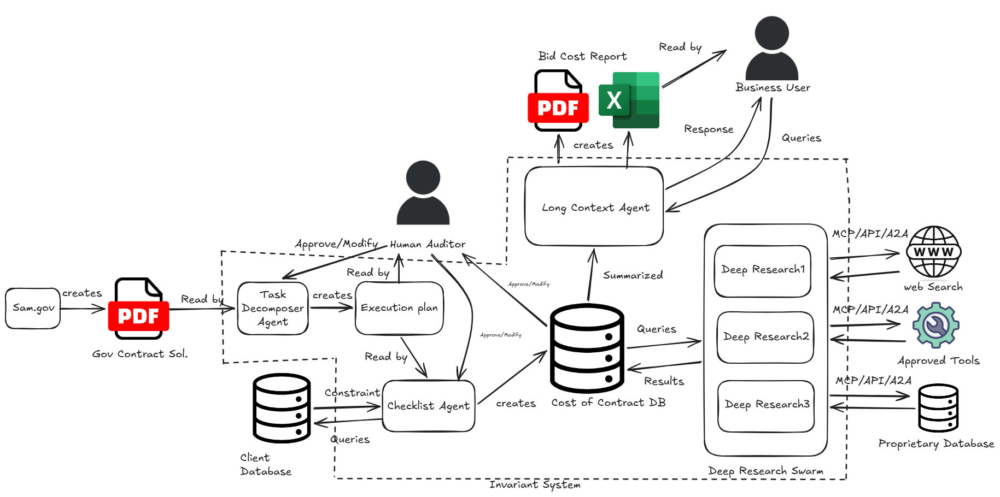
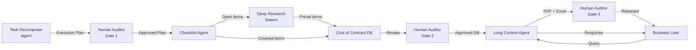

<!-- docs/architecture.md -->

# Architecture

**Project Sentinel is a multi-agent, human-gated pricing pipeline.** Each stage has a defined input contract, a defined output schema, and explicit failure modes. The Cost of Contract DB is the central state store — every agent reads from and writes to it. No agent communicates directly with another.

---

## Pipeline Overview


## Stage A — Task Decomposer Agent

**Input:** SAM.gov Gov Contract Solicitation PDF
**Output:** Structured Execution Plan

The Task Decomposer ingests the raw solicitation document and extracts a formal, leveled Work Breakdown Structure against the SOW, Section L, and Section M. Output is a discrete Execution Plan — a machine-readable list of deliverables, labor categories, ODC line items, and period-of-performance constraints.

The Execution Plan is immediately routed to the Human Auditor before any downstream agent acts on it. No checklist agent, no database write, no research is initiated until the Human Auditor approves or modifies the plan.

**Failure mode:** If the PWS references an attachment absent from the upload, the node is flagged `unresolvable` and surfaced in the Human Auditor review queue. The pipeline does not infer a value.

---

## Stage B — Human Auditor Gate (Execution Plan)

**This is the first of three human intervention points.**

The Human Auditor reviews the Execution Plan produced by the Task Decomposer. They may approve it as-is or modify any node before the Checklist Agent reads it. The approved plan is the authoritative scope definition for the remainder of the pipeline run.

No agent in the Invariant System proceeds past this gate without a recorded approval. The approval is timestamped and identity-linked.

---

## Stage C — Checklist Agent

**Input:** Approved Execution Plan
**Output:** Populated Cost of Contract DB entries

The Checklist Agent maps every line item in the Execution Plan against the Client Database — the client's internal inventory of labor categories, subcontractors, equipment, and historical pricing. Items with an existing internal source are marked `covered` and written to the Cost of Contract DB with their internal price. Items with no match are marked `open` and queued for the Deep Research Swarm.

The Cost of Contract DB is the central state store for the remainder of the pipeline. All subsequent agents read from and write to it exclusively.

---

## Stage D — Deep Research Swarm

**Input:** `open` line items queried from the Cost of Contract DB
**Output:** Price-substantiated records written back to the Cost of Contract DB

The swarm consists of N parallel Deep Research agents, each scoped to a single open line item. Agents are stateless — they receive a specification query from the Cost of Contract DB, execute research against their assigned external source, and write a price record with full source citation back to the DB.

Each agent connects to external sources exclusively via MCP, REST API, or A2A protocol:

| Agent | External Source | Protocol |
|---|---|---|
| Deep Research 1 | Web Search (GSA, FPDS-NG, open market) | MCP / API |
| Deep Research 2 | Approved Tools (GSA Advantage, eBuy, unison.com) | MCP / API |
| Deep Research 3 | Proprietary Database (client-specific historical awards) | A2A / API |

No agent selects its own source. Source assignment is defined in the client configuration file and enforced at the swarm dispatcher level.

If no verifiable price is found within the source hierarchy, the line item is returned as `unresolved` with the full research log attached. The DB is never written with a fabricated or interpolated value.

---

## Stage E — Human Auditor Gate (Cost of Contract DB)

**This is the second human intervention point.**

Before the Long Context Agent compiles the baseline, the Human Auditor reviews the populated Cost of Contract DB. They may approve individual line items, override prices, or flag items for re-research. Overrides are logged with a mandatory justification field.

This gate exists because the swarm may surface multiple valid prices for a single line item. The Human Auditor's override is the mechanism for applying judgment that cannot be encoded in a specification match — incumbent relationships, teaming partner commitments, strategic price-to-win positioning.

---

## Stage F — Long Context Agent

**Input:** Approved Cost of Contract DB
**Output:** Bid Cost Report (PDF), Excel financial baseline

The Long Context Agent holds the entire Cost of Contract DB in context and compiles the final deliverables. It cross-references every line item to its WBS node, applies the fee and wrap rate structure from the client configuration, and generates the locked financial baseline.

The Long Context Agent also serves as the **live query interface for the Business User.** After baseline compilation, the Business User (VP of Capture, Chief Estimator, or Proposal Manager) can query the agent directly — asking questions against the compiled baseline, requesting scenario variations, or drilling into the source citation for a specific line item. The agent responds within the context of the locked, approved baseline. It does not modify the baseline in response to queries.

**Output artifacts:**

- **Bid Cost Report PDF** — formatted cost volume ready for proposal submission
- **Excel Baseline** — cross-referenced financial model with WBS linkage and source citations

---

## Stage G — Human Auditor Gate (Final Output)

**This is the third and final human intervention point.**

The Human Auditor reviews the compiled Bid Cost Report and Excel baseline before they are released to the Business User or submitted as part of a proposal package. Final approval is recorded against the pipeline run ID.

---

## Data Flow Summary


---

## Configuration Reference
```yaml
sentinel:
  pipeline:
    swarm_concurrency_limit: 12
    hil_timeout_hours: 48
    unresolved_threshold: 0.05

  sources:
    deep_research_1:
      type: web_search
      protocol: mcp
      domain_allowlist:
        - gsa.gov
        - sam.gov
        - fpds.gov
        - usaspending.gov
    deep_research_2:
      type: approved_tools
      protocol: api
      tools:
        - gsa_advantage
        - ebuy
        - unison
    deep_research_3:
      type: proprietary_database
      protocol: a2a
      connection: client_config

  output:
    formats: [pdf, xlsx, json]
    fee_structure: client_config
    baseline_lock: true
```
